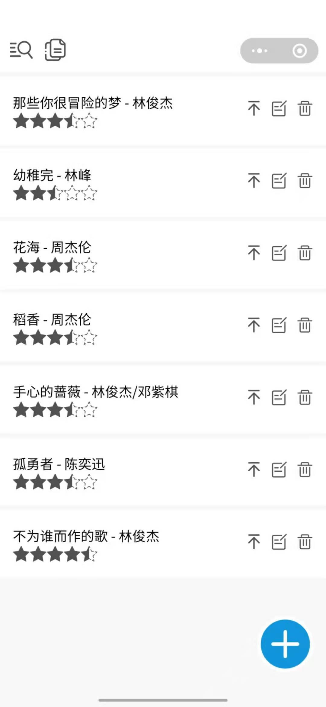

## DEMAND
记录个人喜爱歌曲列表，要支持随意排序，可拖拽，数据存储及同步。

## TODO
 * [x] 音乐信息列表(歌名、歌手、性别、难度星数)
 * [x] 音乐项操作(新增、删除、修改、置顶)
 * [x] 音乐列表操作(排序条件)
 * [x] 可拖拽排序列表
 * [ ] ~~服务端数据可同步(json 文件)~~

## FAQ
Q: 如何实现拖拽？  
A: [利用小程序的 movable-view 组件](https://developers.weixin.qq.com/community/develop/article/doc/000e28e6524c308bec4c6e5e951c13)

Q: 小程序缓存使用文件形式？  
A: 方便在开发预览版和发体验版时能够给予数据，也方便开发调试。(不能实现，小程序 wx.readFile 只允许读取从服务器下载的临时文件。)

Q: 为何要起服务端？  
A: 将在使用手机端进行操作时修改的数据同步到服务端另外存储起来，避免手机端删除小程序后数据完全丢失。(不能实现，设备不能使用没配置的域名相关的网络请求)

## 产品效果图
